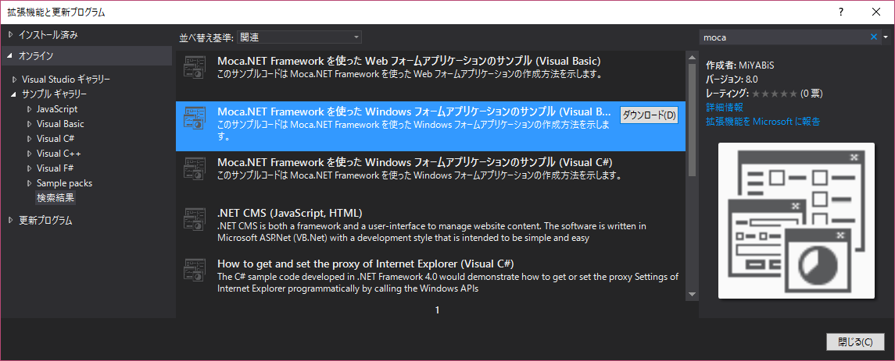
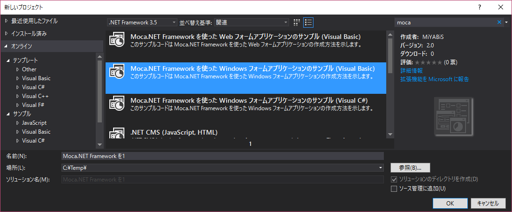
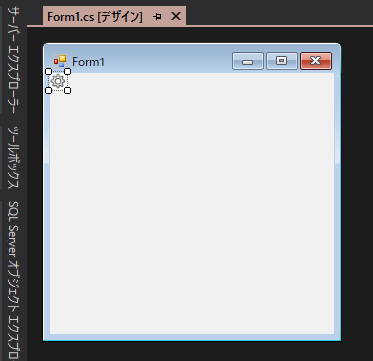
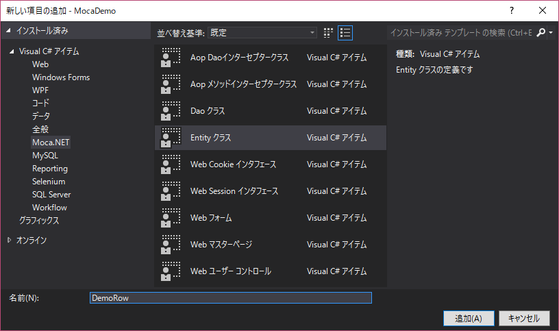
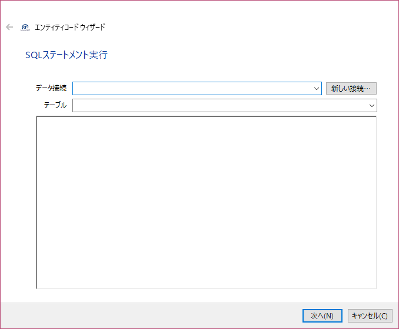
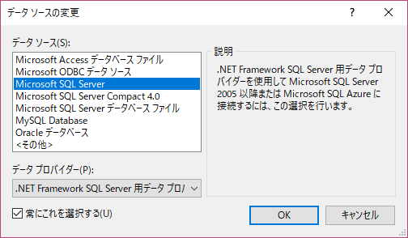
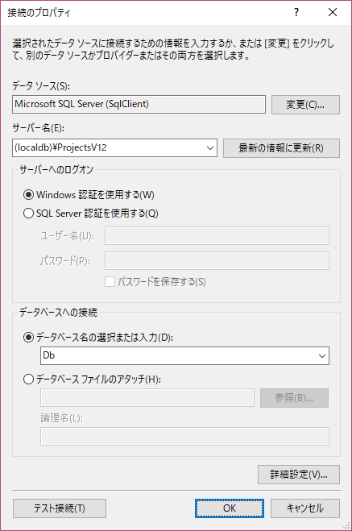
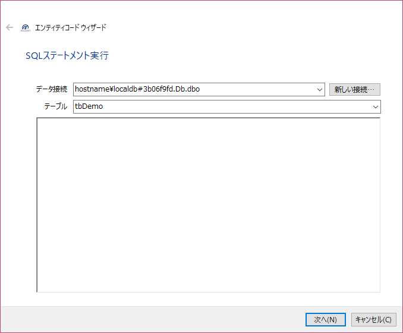
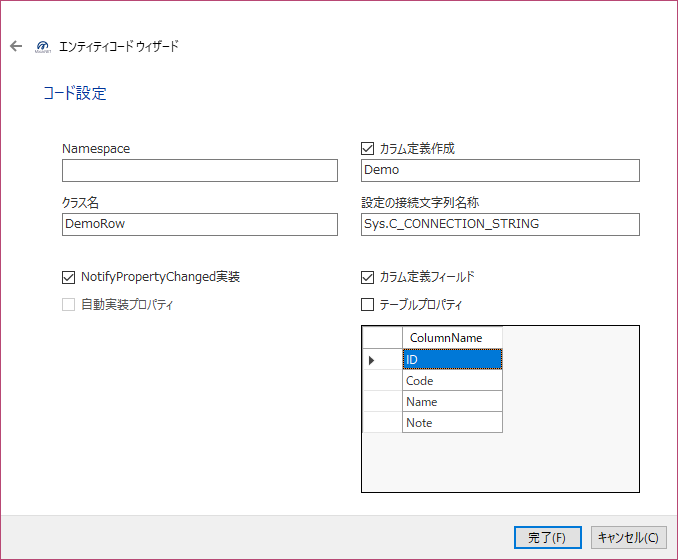
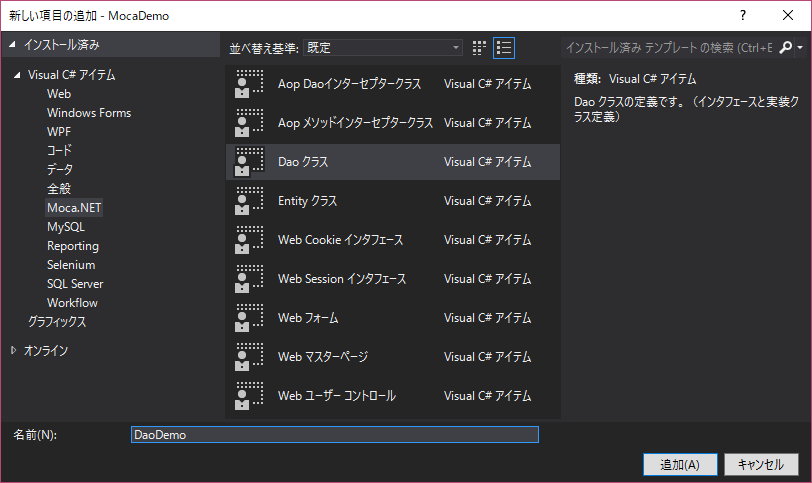

Moca.NET Windows Form App Demo
===================

このサンプルコードは Moca.NET Framework を使った Windows フォームアプリケーションの作成方法を示します。

## 環境構築
### 拡張機能のインストール

* [Moca.NET Templates](https://visualstudiogallery.msdn.microsoft.com/7735e52f-74f2-4ac7-8172-11cde77e6290) ([v2010](https://visualstudiogallery.msdn.microsoft.com/f97a7486-560b-425a-aa05-528dd397f5ba))
* [Moca.NET Code Snippet](https://visualstudiogallery.msdn.microsoft.com/96efa364-a9d3-4352-85fc-c5d117abca7f) ([v2010](https://visualstudiogallery.msdn.microsoft.com/ef40c12b-d48e-45e5-9e18-12726b9ac1ee))

## サンプルのインストール
サンプル ギャラリーから当サンプルをインストールします。


## サンプルのプロジェクトを作成
サンプルのプロジェクトを新しく作成します。


## サンプルのビルドと実行

### 1. Db の配置
Db プロジェクトをスタートアッププロジェクトに設定して F5 キーを押して実行します。（Db が配置される）
### 2. Db 接続先の設定
MocaDemo プロジェクトの接続文字列をDbプロジェクトの「プロパティ」-「デバッグ」-「ターゲット接続文字列」に合わせます。
### 3. 実行
MocaDemo プロジェクトをスタートアッププロジェクトに設定して F5 キーを押して実行します。（ウィンドウが起動してデモが動作する）

動作しないときはDBの配置が出来ていないと思われるので、デモ用にDBを作成して接続文字列を変更後、再度実行してください。


Moca.NET を使って新規に作成するには
===================

## Windows Form プロジェクト作成
通常通りに新規にプロジェクトを作成してください。  
※VB.NET の場合は、Moca.NETのプロジェクトテンプレートを使うこともできます。

### ライブラリの追加
NuGet にて Moca のライブラリを追加します。  
* 『[Moca.NET Project Template Windows Form](https://www.nuget.org/packages/Moca.NETWindowsFormProject/)』

※Moca.NETのプロジェクトテンプレートを使ったときは既に追加されているため不要です。

### ライブラリの更新
追加した Moca のライブラリを最新にします。

### log4net を使う場合
AppConfigTransformAssemblyInfo.(vb or cs) ファイルの log4net 部分のアセンブリ属性を有効にする。

C# : Properties\AppConfigTransformAssemblyInfo.cs
```
[assembly: log4net.Config.XmlConfigurator(ConfigFile=@"log4net.config", Watch=true)]
```

VB : My Project\AppConfigTransformAssemblyInfo.vb
```
<Assembly: log4net.Config.XmlConfigurator(ConfigFile:="log4net.config", Watch:=True)>
```

### 設定ファイルの暗号化
AppConfigTransformAssemblyInfo.(vb or cs) ファイルの Moca 部分のアセンブリ属性を有効にし、暗号種別、暗号化（複合化）したいセクション名を入力する。

C# :
```
[assembly: Moca.Configuration.SectionProtection(Moca.Configuration.ProtectionProviderType.DPAPI, "Section Name")]
```

VB :
```
<Assembly: Moca.Configuration.SectionProtection(Moca.Configuration.ProtectionProviderType.DPAPI, "Section Name")>
```

プログラムの起動時に次のメソッドを実行する。

```
Moca.Configuration.SectionProtector.Protect()
```

### ツールボックスの設定
Moca.NET にあるコントロールをツールボックスに表示させます。

* ツールボックスウィンドウで右クリックメニュー「タブの追加」を実行します。（判別出来るように名称を付けてください）
* 追加したタブ内で右クリックメニュー「アイテムの選択」を実行します。
* 「.NET Framework コンポーネント」の参照ボタンでソリューションファイルと同一フォルダの packages フォルダ配下から「Moca.NETControls.x.x.x」-「lib」-「netxx」-「MocaControls.dll」を選択します。
* 読み込まれたら「OK」ボタンで決定します。

### 初期化・終了処理

#### VB.NET
ApplicationEvents.vb の MyApplication クラスで Startup と Shutdown をハンドルして初期化・終了処理を行っています。

VB :
```
Imports Moca.Di

Namespace My

	Partial Friend Class MyApplication

		Private Sub MyApplication_Startup(sender As Object, e As Microsoft.VisualBasic.ApplicationServices.StartupEventArgs) Handles Me.Startup
			' Moca初期化
			MocaContainerFactory.Init()
		End Sub

        Private Sub MyApplication_Shutdown(sender As Object, e As System.EventArgs) Handles Me.Shutdown
			' Moca初期化
			MocaContainerFactory.Destroy()
		End Sub

	End Class


End Namespace
```

#### C#
Program.cs の Main メソッドで初期化・終了処理を行っています。

C# :
```
using System;
using System.Windows.Forms;
using Moca.Di;

namespace MocaDemo
{
	static class Program
	{
		/// <summary>
		/// アプリケーションのメイン エントリ ポイントです。
		/// </summary>
		[STAThread]
		static void Main()
		{
			MocaContainerFactory.Init();	// Moca初期化

			Application.EnableVisualStyles();
			Application.SetCompatibleTextRenderingDefault(false);
			Application.Run(new Index());

			MocaContainerFactory.Destroy();	// Moca終了
		}
	}
}
```

### Windows フォーム作成
* 標準テンプレートの 「**Windows フォーム**」で作成してください。  
* 先ほど設定したツールボックスから「**MocaDi**」を追加します。

  

## データベースアクセス
Moca.NET では、データベースアクセスクラスを作成してアクセスします。

### エンティティ 作成
Moca.NET テンプレートの「**Entity クラス**」で作成します。  
ウィザード形式で、接続先DBを選択しSQLステートメントを実行することでクラスを作成します。

  
  名前は後でも指定できます。

  
  「新しい接続」ボタンでテスト用DBへの接続情報を設定します。既に存在するときは選択してください。

  
  データソースを指定します。

  
  接続情報を指定します。

  
  接続先とテーブルを選択します。SQL文を入力することもできます。

  
  コードに出力する情報を指定します。

### Dao 作成
Moca.NET テンプレートの「**Dao クラス**」で作成できます。インタフェースと実装クラスの構成で作成されます。
  

接続先はインタフェース毎の指定となり、Dao 属性の引数に設定ファイル（Config）の connectionStrings キーを指定することでデータベースへアクセスできるようになります。
メソッド内のコードはスニペット（DAODelete、DAOInsert、DAOSelect、DAOStoredPrepare、DAOStoredSelect、DAOStoredUpd、DAOUpdate）を使ってください。

### トランザクション処理
更新系のSQLステートメントを実行するときは、インタフェースのメソッドへ Transaction 属性を付けてください。
この属性を付けると、トランザクションの開始、コミット、例外発生時のロールバックを自動で行います。
TransactionScope（MSDTC）を使うときは設定ファイルの moca セクションの transaction タグの Type 属性へ scope を指定し、使わないときは local を指定してください。

### フォームで Dao を使う
フォームクラスのフィールドとして定義してください。  
インスタンス化は **MocaDiコントロール** で自動で行うので New しないでください。

## アスペクト
Moca.NET では、アスペクト属性を使ってインターセプターを割り込ませることができます。
アスペクト属性を付けたメソッドを持つクラスは、使う側のクラスをインジェクト（Moca.Di.MocaInjector.Inject()）してください。
インターセプタークラスは「AOP メソッドインターセプタークラス」テンプレートを使って作成します。
DaoクラスでDBをメインに使ったインターセプターは「AOP Daoインターセプタークラス」テンプレートを使用してください。


## 注意点
Moca.NET では透過プロキシを使っています。Visual Studio 2015で透過型プロキシの値をウォッチしても現状だと見ることができません。下記を参考にオプションの設定を変更することで見ることができるようになります。

[Visual Studio 2015で透過型プロキシのランタイム型をウォッチする際の注意点について](https://blogs.msdn.microsoft.com/jpvsblog/2016/03/28/visual-studio-2015-transparentproxy/)
